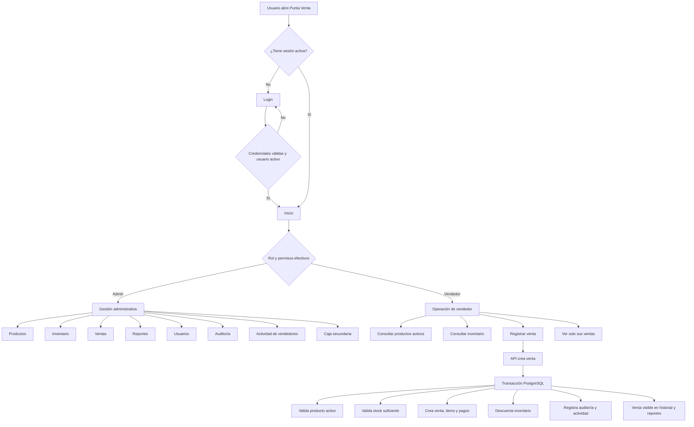
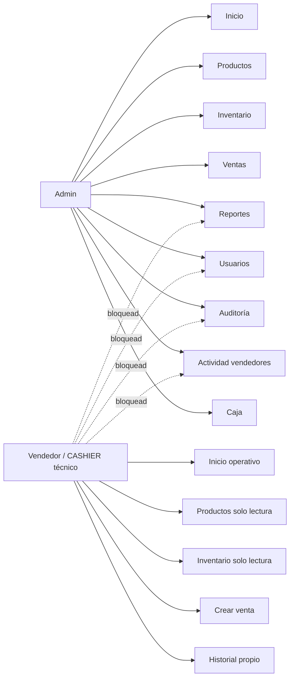
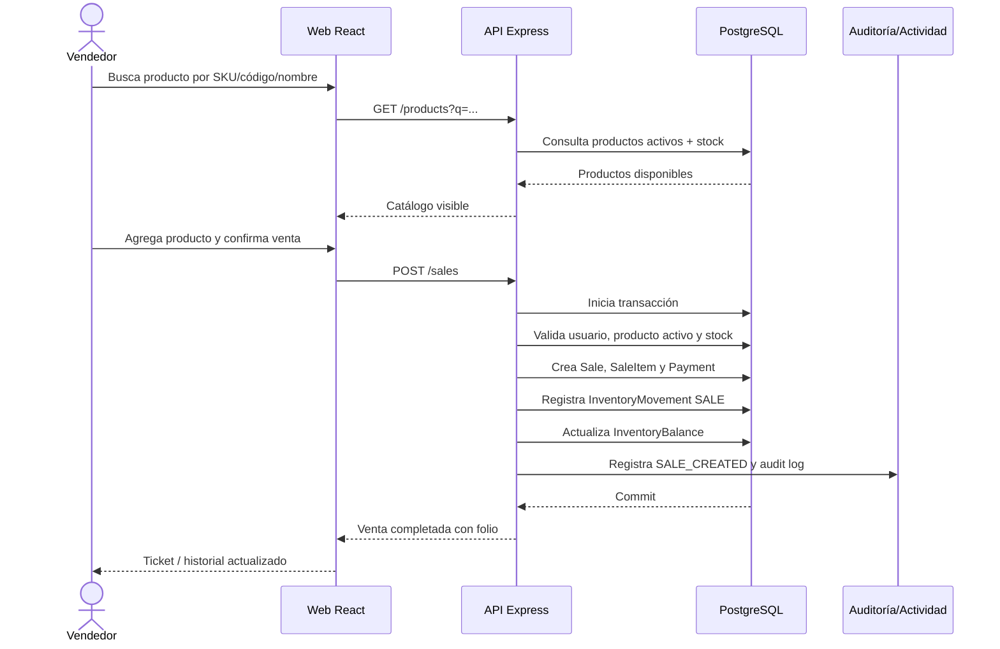
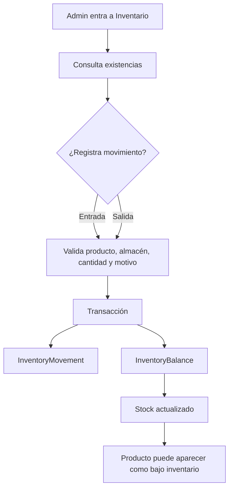
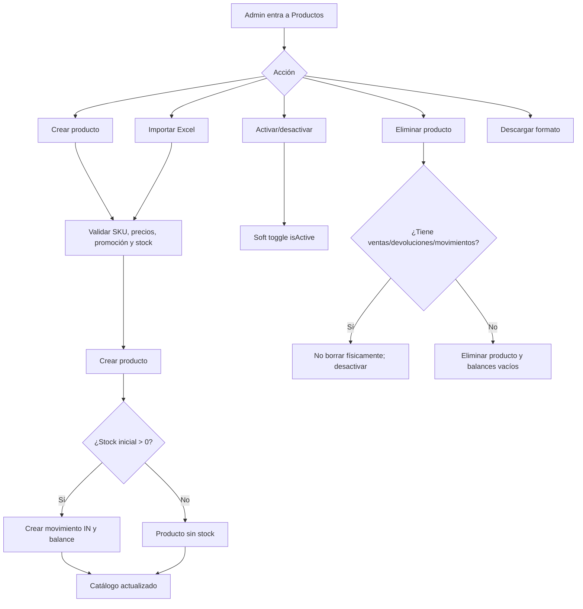
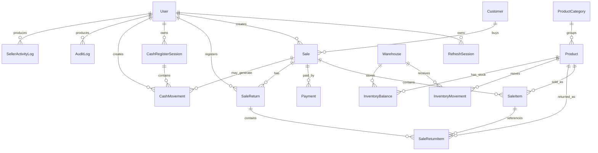

# Diagramas de flujo y modelo de datos

Este documento resume el comportamiento esperado de Punta Venta. Debe usarse como referencia para nuevas pruebas, refactors y validaciones manuales.

## Flujo funcional principal



## Mapa de módulos por rol



## Flujo de venta real



## Flujo de inventario



## Flujo de producto



## Modelo entidad-relación principal



## Reglas de integridad relevantes

- Una venta no depende de una caja abierta.
- El vendedor solo puede ver sus ventas; el admin puede ver operación completa.
- La venta debe descontar inventario real en una transacción.
- Las devoluciones deben reponer inventario y actualizar el estado de venta.
- La eliminación física de productos solo debe permitirse si el producto no tiene historial transaccional.
- Si el producto tiene ventas, devoluciones o movimientos, se debe desactivar en lugar de borrar para conservar trazabilidad.
- Los reportes deben derivarse de ventas, pagos, devoluciones, inventario y usuarios persistidos, no de cálculos aislados del frontend.

## Matriz mínima de pruebas funcionales

| Módulo | Acciones mínimas a cubrir |
| --- | --- |
| Login | login correcto, credenciales inválidas, logout, refresh. |
| Inicio | métricas por rol, navegación desktop y móvil. |
| Productos | crear, buscar, importar, descargar formato, activar/desactivar, eliminar/desactivar seguro. |
| Inventario | consultar stock, entrada, salida, validación de cantidad inválida. |
| Ventas | buscar producto, agregar/quitar, crear venta, cancelar, devolver, bloqueo sin stock. |
| Reportes | filtrar por fecha, búsqueda interna, ventas por vendedor, productos, estados, PDF. |
| Usuarios | crear, cambiar rol, reset contraseña, activar/desactivar, bloqueo vendedor. |
| Actividad vendedores | filtros por vendedor, acción, fecha y búsqueda. |
| Auditoría | filtros por usuario, acción, tabla, registro y fechas. |
| Caja | abrir, cerrar, movimiento manual, bloqueo por permisos. |
```
